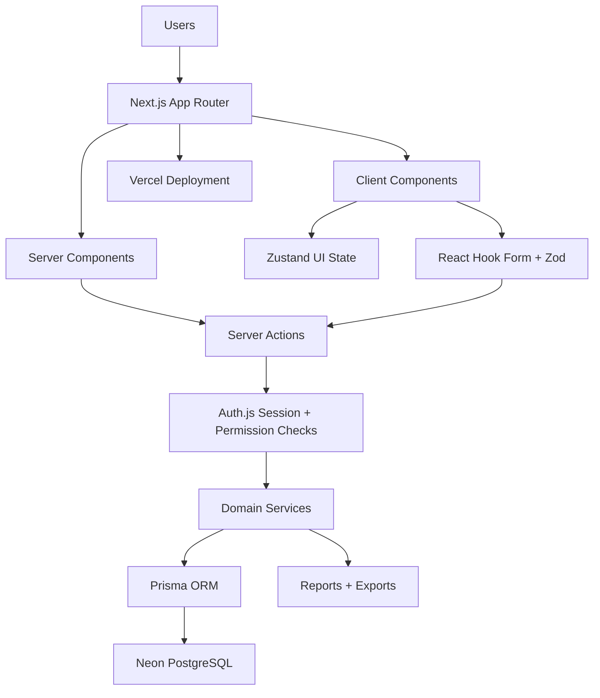

# Pharmacy CRM & Inventory Management System - Project Plan

## Table of Contents

1. [Project Overview](#1-project-overview)
2. [Technology Stack](#2-technology-stack)
3. [System Architecture](#3-system-architecture)
4. [Suggested Folder Structure](#4-suggested-folder-structure)
5. [Core Modules](#5-core-modules)
6. [Database Planning](#6-database-planning)
7. [Pharmacy Business Rules](#7-pharmacy-business-rules)
8. [Authentication](#8-authentication)
9. [Authorization](#9-authorization)
10. [Inventory Logic](#10-inventory-logic)
11. [Purchase Workflow](#11-purchase-workflow)
12. [Sales Workflow](#12-sales-workflow)
13. [Financial Module](#13-financial-module)
14. [Dashboard](#14-dashboard)
15. [Reports](#15-reports)
16. [UI/UX Guidelines](#16-uiux-guidelines)
17. [Development Roadmap](#17-development-roadmap)
18. [MVP Definition](#18-mvp-definition)
19. [Deployment Plan](#19-deployment-plan)
20. [Coding Standards](#20-coding-standards)
21. [Future Roadmap](#21-future-roadmap)

---

## 1. Project Overview

### Project Description

The Pharmacy CRM & Inventory Management System is a professional web application for managing pharmacy operations, including products, batches, suppliers, customers, purchases, sales, inventory movements, payments, expenses, reporting, and role-based access control.

The system is designed for pharmacies that need accurate stock tracking, expiry control, financial visibility, and reliable daily sales operations. It should support practical pharmacy workflows such as FEFO batch selection, purchase receiving, sales returns, damaged stock handling, customer debts, supplier payables, and expiring product alerts.

### Business Goals

- Improve stock accuracy across products, batches, and warehouses.
- Reduce losses caused by expired, damaged, or misplaced inventory.
- Speed up purchase, sales, and payment workflows.
- Provide clear financial visibility for owners and managers.
- Standardize pharmacy operations through auditable business rules.
- Support future growth into multiple warehouses, branches, integrations, and analytics.

### System Objectives

- Provide a secure, role-based application for pharmacy teams.
- Maintain a complete audit trail for inventory and financial changes.
- Track product quantities by batch, expiry date, unit, and warehouse.
- Generate operational and financial reports for decision-making.
- Keep the architecture maintainable, scalable, and suitable for production deployment.

### Target Users

| User Type | Primary Needs |
| --- | --- |
| Owner/Admin | Full system control, reporting, users, permissions, settings |
| Manager | Daily operations, approvals, inventory visibility, reports |
| Warehouse Staff | Receiving stock, stock counts, adjustments, damaged/expired items |
| Sales Staff | Customer sales, returns, product lookup, invoice printing |
| Accountant | Payments, collections, expenses, cashbox, bank balances |
| Viewer/Auditor | Read-only access to dashboards and reports |

---

## 2. Technology Stack

| Technology | Selection Reason |
| --- | --- |
| Next.js 15 | Provides App Router, Server Components, Server Actions, file-based routing, API capabilities, strong Vercel support, and production-grade React architecture. |
| TypeScript | Improves correctness, maintainability, refactoring safety, and API contract clarity across frontend, backend, validation, and database layers. |
| Tailwind CSS | Enables fast, consistent styling with utility classes and design tokens without maintaining large custom CSS files. |
| shadcn/ui | Provides accessible, composable UI primitives that can be customized directly inside the project instead of depending on opaque component packages. |
| Prisma ORM | Gives type-safe database access, migrations, relations, transactions, and clear schema management for PostgreSQL. |
| PostgreSQL | Reliable relational database for transactional inventory, invoices, payments, permissions, and financial records. |
| Auth.js | Modern authentication framework compatible with Next.js App Router and common credential/session strategies. |
| Zustand | Lightweight client state management for UI state such as filters, dialogs, cart drafts, selected warehouse, and transient preferences. |
| TanStack Table | Powerful table engine for sorting, filtering, pagination, column visibility, row selection, and large operational grids. |
| React Hook Form | Efficient form handling with minimal re-renders, excellent validation integration, and good ergonomics for complex invoices. |
| Zod | Runtime validation for forms, Server Actions, API input, environment variables, and shared schemas. |
| Recharts | Practical charting library for dashboards and reports using React components. |
| Lucide React | Clean icon set that works well with shadcn/ui and supports consistent action buttons and navigation. |
| Vercel | Native hosting platform for Next.js with preview deployments, environment management, and CI/CD from GitHub. |
| GitHub | Version control, pull requests, issue tracking, branch protection, and deployment integration. |

---

## 3. System Architecture

### Frontend

The frontend uses Next.js App Router with route groups for public, authenticated, and admin areas. Server Components should fetch stable page data where possible. Client Components should be used only for interactive controls, forms, tables, modals, charts, and local UI state.

### Backend

The backend lives inside the Next.js application using Server Actions for mutations and route handlers where an HTTP endpoint is required. Business logic should be placed in service modules so it can be tested without rendering pages.

### Database

PostgreSQL stores all transactional data. Prisma manages the schema, relations, migrations, and typed queries. Inventory and financial mutations must use database transactions to keep invoices, balances, stock movements, and batch quantities consistent.

### Authentication

Auth.js handles login, logout, sessions, protected routes, and identity lookup. Middleware protects authenticated route groups. Authorization checks are applied server-side before sensitive reads and writes.

### State Management

Use server data as the source of truth. Zustand should be limited to client-only UI state, such as invoice draft UI behavior, table preferences, sidebar state, selected warehouse, and dialog state.

### File Structure

The project should separate routing, UI components, database access, domain services, validation, and types. Keep feature logic close enough to its module to avoid a generic utility pile.

### Deployment

GitHub pushes trigger Vercel builds. Neon PostgreSQL provides production and preview databases. Prisma migrations run through controlled deployment steps, not ad hoc production edits.

### Architecture Diagram



---

## 4. Suggested Folder Structure

```text
app/
  (auth)/
  (dashboard)/
  api/
  layout.tsx
  page.tsx
components/
  ui/
  layout/
  forms/
  tables/
  charts/
actions/
lib/
prisma/
store/
hooks/
types/
validations/
services/
utils/
constants/
```

| Folder | Responsibility |
| --- | --- |
| `app/` | Routes, layouts, pages, loading states, error boundaries, and route handlers. |
| `app/(auth)/` | Login and authentication-related pages. |
| `app/(dashboard)/` | Protected operational pages such as dashboard, products, purchases, sales, reports, and settings. |
| `app/api/` | Route handlers for webhooks, exports, or integration endpoints that require HTTP access. |
| `components/ui/` | shadcn/ui components owned by the project. |
| `components/layout/` | Sidebar, top navigation, breadcrumbs, shell layout, and page headers. |
| `components/forms/` | Reusable form fields and composed form sections. |
| `components/tables/` | TanStack Table wrappers, column definitions, filters, and table toolbars. |
| `components/charts/` | Recharts widgets and dashboard chart components. |
| `actions/` | Server Actions for mutations and simple server-side commands. |
| `lib/` | Shared infrastructure such as Prisma client, Auth.js config, permissions helpers, and environment parsing. |
| `prisma/` | Prisma schema, migrations, and seed scripts. |
| `store/` | Zustand stores for client-only UI state. |
| `hooks/` | Client hooks for reusable interaction logic. |
| `types/` | Shared TypeScript types that are not generated by Prisma. |
| `validations/` | Zod schemas for forms, Server Actions, and environment variables. |
| `services/` | Domain services for inventory, purchases, sales, payments, reports, and permissions. |
| `utils/` | Small pure helpers. Avoid broad utility abstractions unless reused. |
| `constants/` | Stable constants such as role names, stock movement types, statuses, and routes. |

---

## 5. Core Modules

### Authentication

**Purpose:** Secure access to the system.

**Features:**

- Email/password login.
- Logout.
- Session expiry and renewal.
- Protected dashboard routes.
- Server-side identity checks.

**Pages:**

- `/login`
- `/forgot-password` if password reset is required after MVP
- `/settings/security`

**CRUD Operations:**

- Create user session.
- Read current session.
- Delete session on logout.

**Business Rules:**

- Inactive users cannot log in.
- Sensitive actions require an authenticated user.
- Session data must not expose password hashes or private security fields.

### Dashboard

**Purpose:** Provide quick operational and financial visibility.

**Features:**

- Sales totals.
- Inventory value.
- Low stock alerts.
- Expiry alerts.
- Customer debts.
- Supplier payables.
- Cash and bank balances.

**Pages:**

- `/dashboard`

**CRUD Operations:**

- Read aggregated metrics.

**Business Rules:**

- Metrics must respect user permissions.
- Date filters should default to the current business day or month.

### Products

**Purpose:** Manage pharmacy items and product metadata.

**Features:**

- Product catalog.
- SKU/barcode fields.
- Category assignment.
- Unit configuration.
- Minimum stock level.
- Active/inactive status.

**Pages:**

- `/products`
- `/products/new`
- `/products/[id]`
- `/products/[id]/edit`

**CRUD Operations:**

- Create, read, update, deactivate products.
- Avoid hard deletes when products have transactions.

**Business Rules:**

- Product name or SKU should be unique according to business policy.
- Products with stock or invoice history cannot be deleted.
- Inactive products cannot be purchased or sold unless explicitly reactivated.

### Categories

**Purpose:** Organize products for navigation, reporting, and filtering.

**Features:**

- Category list.
- Parent-child categories if needed.
- Active/inactive status.

**Pages:**

- `/categories`
- `/categories/new`
- `/categories/[id]/edit`

**CRUD Operations:**

- Create, read, update, deactivate categories.

**Business Rules:**

- Categories used by active products cannot be hard deleted.
- Category names should be unique within the same parent.

### Suppliers

**Purpose:** Track vendors, supplier invoices, payments, and payables.

**Features:**

- Supplier profile.
- Contact information.
- Opening balance.
- Purchase history.
- Payment history.
- Current payable balance.

**Pages:**

- `/suppliers`
- `/suppliers/new`
- `/suppliers/[id]`
- `/suppliers/[id]/edit`
- `/suppliers/[id]/statement`

**CRUD Operations:**

- Create, read, update, deactivate suppliers.

**Business Rules:**

- Suppliers with invoices cannot be hard deleted.
- Opening balance must create an auditable financial entry.
- Supplier balance increases on credit purchases and decreases on payments or purchase returns.

### Customers

**Purpose:** Manage customer records, sales history, collections, and receivables.

**Features:**

- Customer profile.
- Contact information.
- Credit limit.
- Opening balance.
- Sales history.
- Collection history.
- Statement.

**Pages:**

- `/customers`
- `/customers/new`
- `/customers/[id]`
- `/customers/[id]/edit`
- `/customers/[id]/statement`

**CRUD Operations:**

- Create, read, update, deactivate customers.

**Business Rules:**

- Customers with invoices cannot be hard deleted.
- Credit sales should validate credit limit if enabled.
- Customer balance increases on credit sales and decreases on collections or sales returns.

### Purchase Management

**Purpose:** Record supplier purchases and receive stock into inventory.

**Features:**

- Purchase invoices.
- Purchase items.
- Batch and expiry capture.
- Supplier balance update.
- Stock movement creation.
- Partial or full payment at purchase time.

**Pages:**

- `/purchases`
- `/purchases/new`
- `/purchases/[id]`
- `/purchases/[id]/edit` for draft invoices only
- `/purchases/[id]/return`

**CRUD Operations:**

- Create purchase drafts.
- Confirm purchases.
- Read purchase invoices.
- Update drafts.
- Cancel drafts.
- Create purchase returns.

**Business Rules:**

- Confirmed purchases should not be edited directly.
- Confirming a purchase increases stock by batch and warehouse.
- Each received item must have product, quantity, cost, batch number, expiry date, and warehouse.
- Supplier balance increases by unpaid invoice amount.

### Sales Management

**Purpose:** Process customer sales and reduce inventory correctly.

**Features:**

- Sales invoices.
- FEFO batch selection.
- Customer balance update.
- Payment capture.
- Invoice print.
- Sales returns.

**Pages:**

- `/sales`
- `/sales/new`
- `/sales/[id]`
- `/sales/[id]/return`

**CRUD Operations:**

- Create sale.
- Read invoice.
- Cancel draft sale.
- Create sales return.

**Business Rules:**

- Sales cannot reduce stock below available quantity unless negative stock is explicitly enabled.
- FEFO should select the earliest expiry batches first.
- Expired batches cannot be sold.
- Customer balance increases by unpaid invoice amount.

### Inventory Management

**Purpose:** Maintain accurate quantities across products, batches, and warehouses.

**Features:**

- Current stock.
- Batch stock.
- Stock movements.
- Adjustments.
- Damaged stock.
- Expired stock.
- Stock counts.

**Pages:**

- `/inventory`
- `/inventory/batches`
- `/inventory/movements`
- `/inventory/adjustments`
- `/inventory/stock-counts`

**CRUD Operations:**

- Read stock.
- Create adjustment.
- Create damage movement.
- Create expiry movement.
- Create stock count.

**Business Rules:**

- Inventory changes must create stock movement records.
- Current stock should be derived from movements or kept in sync transactionally.
- Adjustments require reason, user, date, and approval if configured.

### Payments

**Purpose:** Record supplier payments and customer collections.

**Features:**

- Customer collections.
- Supplier payments.
- Cashbox and bank account selection.
- Payment method.
- Linked invoice allocation.

**Pages:**

- `/payments`
- `/payments/customer-collections`
- `/payments/supplier-payments`

**CRUD Operations:**

- Create, read, void payments.

**Business Rules:**

- Payments should not be deleted after posting; they should be voided.
- Customer collections decrease receivables.
- Supplier payments decrease payables.
- Cash or bank balance changes must be auditable.

### Expenses

**Purpose:** Track operational spending.

**Features:**

- Expense categories.
- Expense recording.
- Cashbox or bank account payment source.
- Attachments in future phase.

**Pages:**

- `/expenses`
- `/expenses/new`
- `/expenses/[id]`

**CRUD Operations:**

- Create, read, update draft, void posted expenses.

**Business Rules:**

- Posted expenses reduce cash or bank balance.
- Voided expenses reverse the financial effect.

### Reports

**Purpose:** Provide operational, financial, and inventory insight.

**Features:**

- Date filters.
- Entity filters.
- Warehouse filters.
- Export to Excel, PDF, and print.

**Pages:**

- `/reports`
- `/reports/sales`
- `/reports/purchases`
- `/reports/inventory`
- `/reports/profit`
- `/reports/expiry`

**CRUD Operations:**

- Read and export report data.

**Business Rules:**

- Reports must use posted transactions only unless the report explicitly includes drafts.
- Financial reports should define whether returns, discounts, and taxes are included.

### Users

**Purpose:** Manage staff access.

**Features:**

- User accounts.
- Role assignment.
- Active/inactive status.
- Password reset flow.

**Pages:**

- `/users`
- `/users/new`
- `/users/[id]/edit`

**CRUD Operations:**

- Create, read, update, deactivate users.

**Business Rules:**

- Users with historical actions cannot be hard deleted.
- Users cannot remove their own admin access if they are the only admin.

### Roles & Permissions

**Purpose:** Control access to features and sensitive actions.

**Features:**

- Predefined roles.
- Permission matrix.
- Server-side authorization checks.

**Pages:**

- `/settings/roles`
- `/settings/permissions`

**CRUD Operations:**

- Read roles.
- Assign permissions.
- Assign roles to users.

**Business Rules:**

- Permission checks must happen on the server.
- UI hiding is convenience only, not security.

### Settings

**Purpose:** Configure pharmacy-level preferences.

**Features:**

- Pharmacy profile.
- Invoice numbering.
- Currency.
- Tax settings.
- Stock policy.
- Low stock thresholds.

**Pages:**

- `/settings`
- `/settings/company`
- `/settings/inventory`
- `/settings/billing`

**CRUD Operations:**

- Read and update settings.

**Business Rules:**

- Settings changes should be audited.
- Invoice numbering changes must not create duplicate invoice numbers.

---

## 6. Database Planning

### Database Architecture

The database should be relational, transaction-safe, and designed around posted business events. Key operational tables include users, roles, products, batches, invoices, invoice items, stock movements, payments, and expenses.

Inventory should be auditable. Each stock increase or decrease must create a stock movement linked to its source document when possible. Financial balances should be derived from invoices, payments, returns, opening balances, and expenses, or stored as cached balances updated only inside transactions.

### Entities

| Entity | Description | Key Relationships |
| --- | --- | --- |
| User | Staff account used for authentication and auditing. | Belongs to Role; creates invoices, payments, movements. |
| Role | Named access level such as Admin or Sales. | Has many Users; has many Permissions. |
| Permission | Specific capability such as `sales.create`. | Many-to-many with Role. |
| Category | Product grouping. | Has many Products. |
| Product | Sellable or purchasable pharmacy item. | Belongs to Category; has Units, Batches, invoice items. |
| Product Unit | Unit definition such as box, strip, tablet. | Belongs to Product. |
| Batch | Stock lot with batch number, expiry date, cost, and quantity. | Belongs to Product and Warehouse; linked to stock movements. |
| Warehouse | Physical or logical stock location. | Has many Batches and Stock Movements. |
| Stock Movement | Auditable stock change. | Belongs to Product, Batch, Warehouse, User, and source document. |
| Supplier | Vendor profile and payable account. | Has Purchase Invoices and Payments. |
| Customer | Buyer profile and receivable account. | Has Sales Invoices and Payments. |
| Purchase Invoice | Supplier purchase document. | Belongs to Supplier; has Purchase Items and Payments. |
| Purchase Item | Product line on purchase invoice. | Belongs to Purchase Invoice, Product, Batch. |
| Sales Invoice | Customer sale document. | Belongs to Customer optionally; has Sales Items and Payments. |
| Sales Item | Product line on sales invoice. | Belongs to Sales Invoice, Product, Batch. |
| Payment | Money movement for customer collection or supplier payment. | Links to Customer, Supplier, invoices, cashbox, or bank account. |
| Expense | Operational spending record. | Belongs to expense category, user, and payment account. |

### Relationship Notes

- A `Product` can have many `Batch` records.
- A `Batch` belongs to one `Product` and one `Warehouse`.
- A `Purchase Invoice` contains many `Purchase Items`; each item creates or updates a batch.
- A `Sales Invoice` contains many `Sales Items`; each item consumes one or more batches.
- A `Stock Movement` records every inventory mutation and references the source transaction type.
- A `Payment` can be linked to a customer, supplier, or invoice allocation depending on payment type.
- Roles and permissions should use a many-to-many relationship for flexibility.

---

## 7. Pharmacy Business Rules

### Batch Number

Each purchased product line must capture a batch number. Batch numbers allow tracking recalls, expiry, cost, and stock history. The same product can have multiple active batches.

### Expiry Date

Each batch must have an expiry date when the product requires expiry tracking. Expired batches cannot be sold. Expiry reports should identify products approaching expiry based on configurable thresholds such as 30, 60, or 90 days.

### FEFO

FEFO means First Expired First Out. Sales should consume stock from the earliest valid expiry date first. If multiple batches have the same expiry date, use the oldest received batch first.

### Opening Balance

Opening balances initialize customer debts, supplier payables, cashbox balances, bank balances, and stock quantities. Opening stock should create stock movement records with type `OPENING_BALANCE`.

### Stock Adjustment

Stock adjustments correct inventory after count differences or operational errors. Each adjustment requires product, batch, warehouse, quantity change, reason, user, and timestamp.

### Damaged Items

Damaged items reduce sellable stock. Damage movements should capture quantity, batch, reason, user, and optional notes.

### Expired Items

Expired stock should be removed from sellable inventory through an expiry movement. The system should support reporting before removal and posting the removal after review.

### Purchase Returns

Purchase returns reduce stock and supplier payable balance. Returned quantities must not exceed available quantity from the purchased batch unless business policy allows manual override.

### Sales Returns

Sales returns increase stock if returned items are sellable. If returned items are damaged or expired, they should be recorded into damaged or expired stock instead of sellable inventory.

---

## 8. Authentication

### Login

Users log in with credentials managed by Auth.js. The login form validates inputs with Zod and displays safe, generic errors.

### Logout

Logout destroys the active session and redirects the user to the login page.

### Protected Routes

Dashboard routes require an authenticated session. Middleware should redirect unauthenticated users to `/login`.

### Session Management

Session payloads should include only the fields required for identity and authorization, such as user ID, role ID, role name, and active status.

### Auth.js Integration

Auth.js should be configured in `lib/auth` with providers, session strategy, callbacks, and protected route helpers. Password verification should happen server-side only.

---

## 9. Authorization

### Roles

| Role | Purpose |
| --- | --- |
| Admin | Full system access and configuration. |
| Manager | Operational oversight, approvals, and reports. |
| Warehouse | Stock receiving, counts, adjustments, and inventory views. |
| Sales | Sales invoices, customer lookup, and sales returns. |
| Accountant | Payments, collections, expenses, and financial reports. |
| Viewer | Read-only access to allowed dashboards and reports. |

### Permission Matrix

| Module | Admin | Manager | Warehouse | Sales | Accountant | Viewer |
| --- | --- | --- | --- | --- | --- | --- |
| Dashboard | Full | Full | Limited | Limited | Financial | Read |
| Products | Full | Full | Read | Read | Read | Read |
| Categories | Full | Full | Read | Read | Read | Read |
| Suppliers | Full | Full | Read | None | Full | Read |
| Customers | Full | Full | Read | Full | Full | Read |
| Purchases | Full | Full | Create/Receive | None | Read/Pay | Read |
| Sales | Full | Full | Read | Full | Read | Read |
| Inventory | Full | Full | Full | Read | Read | Read |
| Payments | Full | Approve | None | Collections | Full | Read |
| Expenses | Full | Approve | None | None | Full | Read |
| Reports | Full | Full | Inventory | Sales | Financial | Read |
| Users | Full | Read | None | None | None | None |
| Settings | Full | Limited | None | None | None | None |

---

## 10. Inventory Logic

| Operation | Quantity Effect | Required Records |
| --- | --- | --- |
| Purchase | Increases batch and warehouse stock. | Purchase invoice, purchase items, stock movements. |
| Sale | Decreases batch and warehouse stock using FEFO. | Sales invoice, sales items, stock movements. |
| Purchase Return | Decreases stock and supplier payable. | Return document, stock movement, supplier balance entry. |
| Sales Return | Increases sellable stock or moves to damaged/expired. | Return document, stock movement, customer balance entry. |
| Adjustment | Increases or decreases stock. | Adjustment record and stock movement. |
| Damage | Decreases sellable stock. | Damage record and stock movement. |
| Expired Stock | Decreases sellable stock. | Expiry record and stock movement. |
| Stock Count | Creates adjustment for variance. | Count record, count lines, adjustment movements. |

### Core Rules

- Every inventory mutation must be posted inside a transaction.
- Stock movements are append-only audit records.
- Batch quantity must never become negative unless negative stock is explicitly enabled.
- Expired batches are excluded from sales availability.
- FEFO allocation must be deterministic and auditable.

---

## 11. Purchase Workflow

1. User creates a purchase invoice draft.
2. User selects supplier, warehouse, products, batch numbers, expiry dates, quantities, unit costs, discounts, and taxes.
3. System validates required fields and totals.
4. User confirms the invoice.
5. System creates or updates batch records.
6. System increases inventory quantities.
7. System creates stock movement records with type `PURCHASE`.
8. System records paid amount, if any.
9. System updates supplier payable balance for unpaid amount.
10. System marks the invoice as posted.

### Business Rules

- Draft invoices can be edited.
- Posted invoices cannot be edited directly.
- Corrections require return, reversal, or adjustment documents.
- Invoice number must be unique.
- Purchase item quantity and cost must be greater than zero.

---

## 12. Sales Workflow

1. User creates a sales invoice.
2. User selects customer or walk-in sale.
3. User adds products and quantities.
4. System checks available stock.
5. System allocates batches using FEFO.
6. System calculates subtotal, discount, tax, paid amount, and balance.
7. User confirms the invoice.
8. System reduces batch quantities.
9. System creates stock movements with type `SALE`.
10. System records customer balance if unpaid.
11. System prints or exports the invoice if needed.

### Business Rules

- Expired batches cannot be allocated.
- Sale quantity cannot exceed available quantity.
- Credit sales must respect customer status and optional credit limit.
- Posted sales require return documents for correction.

---

## 13. Financial Module

### Cashbox

Tracks cash collected and paid from the pharmacy register. Cashbox balance increases with cash sales and customer collections. It decreases with supplier payments, expenses, and cash withdrawals.

### Bank Accounts

Tracks non-cash money movement through bank transfers, card settlement, or other accounts. Each bank transaction should link to its source document.

### Supplier Payments

Supplier payments reduce supplier payable balance. Payments may be allocated to specific purchase invoices or left as account-level payments depending on business policy.

### Customer Collections

Customer collections reduce customer receivable balance. Collections may be linked to sales invoices or recorded against the customer account.

### Expenses

Expenses reduce cash or bank balances and are grouped by category for reporting. Posted expenses should be voided rather than deleted.

---

## 14. Dashboard

### Widgets

| Widget | Description |
| --- | --- |
| Daily Sales | Total sales for the current business day. |
| Monthly Sales | Sales total and trend for the current month. |
| Inventory Value | Current stock value based on cost. |
| Low Stock | Products below minimum stock threshold. |
| Expiring Products | Batches expiring within configured date range. |
| Customer Debts | Total outstanding receivables. |
| Supplier Payables | Total outstanding supplier balances. |
| Cash Balance | Current cashbox balance. |

### Suggested Charts

- Sales by day line chart.
- Sales by category bar chart.
- Purchases vs sales comparison chart.
- Top-selling products table.
- Expiring stock timeline.
- Cash movement chart.

---

## 15. Reports

| Report | Purpose | Filters |
| --- | --- | --- |
| Sales Report | Analyze sales invoices and revenue. | Date, customer, product, user, payment status. |
| Purchase Report | Analyze supplier purchases. | Date, supplier, product, warehouse. |
| Inventory Report | Show current stock by product, batch, and warehouse. | Category, warehouse, expiry status. |
| Stock Movement Report | Audit stock changes. | Date, type, product, batch, warehouse, user. |
| Profit Report | Compare sales revenue with cost. | Date, product, category, invoice. |
| Customer Statement | Show customer invoices, returns, and payments. | Customer, date. |
| Supplier Statement | Show supplier purchases, returns, and payments. | Supplier, date. |
| Expiry Report | Identify expired or soon-to-expire stock. | Date range, warehouse, category. |
| Low Stock Report | List products below reorder threshold. | Category, warehouse. |

### Export Options

- Excel for analysis.
- PDF for formal sharing.
- Print for operational use.

---

## 16. UI/UX Guidelines

### Design System

Use shadcn/ui as the base component system with consistent spacing, typography, form controls, dialogs, dropdowns, buttons, and table patterns. Prefer simple operational screens over decorative marketing layouts.

### Color Palette

| Token | Usage |
| --- | --- |
| Primary | Main actions and active navigation. |
| Secondary | Supporting actions and quiet UI surfaces. |
| Success | Completed payments, available stock, positive status. |
| Warning | Low stock, near expiry, pending approval. |
| Destructive | Delete, void, expired, damaged, failed states. |
| Muted | Table metadata, helper text, disabled UI. |

### Typography

- Use clear hierarchy for page titles, section headings, labels, and table text.
- Keep dense operational screens readable.
- Avoid oversized headings inside dashboards, forms, and tables.

### Layout

- Use a persistent sidebar for main modules.
- Use a top bar for search, user menu, selected warehouse, and notifications.
- Keep page actions in predictable header positions.
- Use tabs for related subviews such as profile, history, statement, and settings.

### Responsive Behavior

- Tables should support horizontal scrolling and column visibility.
- Forms should collapse to one column on small screens.
- Primary actions should remain easy to reach.
- Avoid overlapping text and controls at all viewport sizes.

### Forms

- Use React Hook Form with Zod validation.
- Show field-level errors.
- Keep invoice forms optimized for keyboard entry.
- Use dialogs only for focused sub-actions.

### Tables

- Use TanStack Table for sorting, filtering, pagination, and column visibility.
- Provide status badges for stock, payment, and invoice state.
- Use compact rows for operational density.

### Dialogs

- Use dialogs for confirmations, quick edits, and small workflows.
- Avoid placing large multi-step forms inside cramped dialogs.

### Toasts

- Use toasts for success, failure, and confirmation feedback.
- Error toasts should be concise and actionable.

---

## 17. Development Roadmap

| Sprint | Goals | Deliverables | Complexity |
| --- | --- | --- | --- |
| Sprint 1 | Project foundation. | Next.js setup, Tailwind, shadcn/ui, Prisma, Auth.js, dashboard shell. | Medium |
| Sprint 2 | Master data. | Products, categories, suppliers, customers, basic tables and forms. | Medium |
| Sprint 3 | Purchasing and inventory-in. | Purchase invoices, batch receiving, stock movement creation. | High |
| Sprint 4 | Sales and inventory-out. | Sales invoices, FEFO allocation, invoice printing, stock reduction. | High |
| Sprint 5 | Financial operations. | Payments, collections, expenses, cashbox, bank accounts. | High |
| Sprint 6 | Reporting and analytics. | Reports, dashboard charts, PDF/Excel/print exports. | Medium |
| Sprint 7 | Permissions and production readiness. | Permission matrix, tests, deployment, optimization, backups. | Medium |

### Sprint Details

#### Sprint 1

- Initialize repository and app.
- Configure TypeScript, linting, Tailwind CSS, shadcn/ui.
- Configure Prisma and PostgreSQL.
- Add Auth.js login/logout.
- Build protected dashboard layout.

#### Sprint 2

- Build CRUD for products, categories, suppliers, and customers.
- Add validation schemas.
- Add table filters and pagination.
- Add opening balance fields where required.

#### Sprint 3

- Build purchase invoice workflow.
- Add batch and expiry capture.
- Post stock movements.
- Update supplier balances.

#### Sprint 4

- Build sales invoice workflow.
- Implement FEFO allocation.
- Reduce batch stock.
- Add sales returns.

#### Sprint 5

- Add customer collections.
- Add supplier payments.
- Add expenses.
- Add cashbox and bank account tracking.

#### Sprint 6

- Add reports.
- Add dashboard widgets and charts.
- Add Excel, PDF, and print exports.

#### Sprint 7

- Add role and permission management.
- Add focused tests for inventory, sales, purchases, and payments.
- Deploy to Vercel.
- Configure Neon production database.
- Review performance and security.

---

## 18. MVP Definition

The MVP should include only the features required for first production use.

### Included in MVP

- Authentication and protected routes.
- Admin, Manager, Warehouse, Sales, Accountant, Viewer roles.
- Product and category management.
- Supplier and customer management.
- Batch-aware purchase invoices.
- Sales invoices with FEFO.
- Inventory stock view.
- Stock movements.
- Customer collections.
- Supplier payments.
- Basic expenses.
- Dashboard summary.
- Sales, purchase, inventory, expiry, and low stock reports.
- Vercel deployment with Neon PostgreSQL.

### Excluded from MVP

- Multi-branch operations.
- Offline mode.
- Mobile application.
- Electronic invoicing.
- AI analytics.
- Full accounting ledger.
- External API integrations.
- Barcode hardware integration beyond storing barcode values.

---

## 19. Deployment Plan

### GitHub

- Use GitHub as the source of truth.
- Protect the main branch.
- Use pull requests for reviewed changes.
- Run tests and lint checks before merging.

### Vercel

- Connect GitHub repository to Vercel.
- Use preview deployments for pull requests.
- Use production deployment from the main branch.
- Store environment variables in Vercel project settings.

### Neon PostgreSQL

- Create separate databases or branches for development, preview, and production.
- Use pooled connection strings for serverless runtime where appropriate.
- Keep migration workflow controlled and repeatable.

### Environment Variables

```text
DATABASE_URL=
AUTH_SECRET=
AUTH_URL=
NEXT_PUBLIC_APP_URL=
```

Add provider-specific variables only when the selected Auth.js provider requires them.

### Production Setup

- Configure production database.
- Apply migrations.
- Seed required roles and permissions.
- Create first admin user through a secure bootstrap process.
- Verify login, dashboard, purchase, sale, and report flows.

### CI/CD Workflow

1. Developer opens pull request.
2. CI runs type checks, linting, and tests.
3. Vercel creates preview deployment.
4. Reviewer validates preview.
5. Merge to main triggers production build.
6. Migrations are applied through a controlled deployment step.

### Backup Strategy

- Enable Neon backups or point-in-time recovery according to plan availability.
- Export periodic logical backups for production.
- Test restore procedures regularly.
- Keep backup access restricted.

---

## 20. Coding Standards

### TypeScript Rules

- Use strict TypeScript.
- Avoid `any` except at hard external boundaries with validation.
- Prefer explicit domain types for service inputs and outputs.
- Use generated Prisma types where appropriate.

### Naming Conventions

- Use PascalCase for React components.
- Use camelCase for variables and functions.
- Use kebab-case for route segments.
- Use UPPER_SNAKE_CASE for stable constants only when appropriate.
- Name Server Actions by intent, such as `createPurchaseInvoice`.

### Folder Organization

- Keep route files thin.
- Put business rules in services.
- Put validation in `validations/`.
- Put shared infrastructure in `lib/`.
- Avoid adding folders before there is a real use for them.

### Server Actions

- Validate inputs with Zod.
- Check authentication and authorization.
- Execute business logic through services.
- Return typed success or error results.

### Prisma Usage

- Use transactions for purchases, sales, returns, payments, and stock adjustments.
- Avoid direct database writes from UI components.
- Keep migrations reviewed and committed.
- Use indexes for invoice numbers, batch lookup, product search, and report filters.

### Validation Strategy

- Validate all user input at the server boundary.
- Reuse Zod schemas between forms and Server Actions when practical.
- Validate environment variables at app startup.

### Error Handling

- Show safe messages to users.
- Log internal details server-side.
- Use predictable error shapes for Server Actions.
- Avoid exposing database or stack trace details to the browser.

### Logging

- Log authentication failures, permission denials, posting errors, and critical financial or inventory mutations.
- Do not log passwords, secrets, or sensitive payment details.

### Clean Architecture Principles

- Keep business rules independent from UI components.
- Prefer small services with clear responsibilities.
- Keep database transactions close to the domain operation.
- Avoid speculative abstractions.
- Maintain backwards compatibility once APIs or workflows are used in production.

---

## 21. Future Roadmap

| Feature | Value |
| --- | --- |
| Barcode Scanner | Speeds product lookup, receiving, and sales. |
| QR Codes | Supports invoice verification and product labels. |
| Multi-Warehouse | Enables stock tracking across multiple locations. |
| Multi-Branch | Supports pharmacy chains and centralized reporting. |
| Notifications | Alerts users about low stock, expiry, debts, and approvals. |
| Mobile App | Supports mobile stock counts, approvals, and manager dashboards. |
| Offline Mode | Allows continued sales during temporary connectivity loss. |
| Electronic Invoicing | Supports local tax authority integration where required. |
| Accounting Integration | Syncs transactions with external accounting systems. |
| REST API | Enables integrations with POS, mobile apps, and third-party systems. |
| AI Analytics | Identifies sales trends, anomalies, and product opportunities. |
| Forecasting | Predicts reorder needs and seasonal demand. |

---

## Production Readiness Checklist

- [ ] Authentication configured.
- [ ] Authorization enforced server-side.
- [ ] Prisma migrations reviewed.
- [ ] Inventory transactions tested.
- [ ] FEFO tested with multiple batches.
- [ ] Purchase and sales returns tested.
- [ ] Payment and balance logic tested.
- [ ] Reports validated against source transactions.
- [ ] Environment variables configured.
- [ ] Production database backup enabled.
- [ ] First admin bootstrap completed securely.
- [ ] Vercel production deployment verified.

